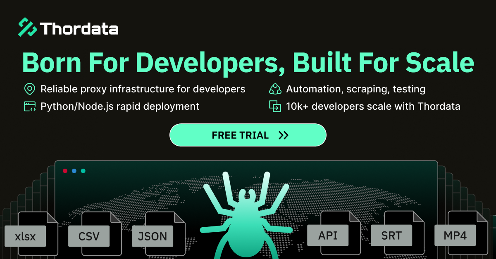

# 🤖 BLUE_XMD

BLUE_XMD est un bot WhatsApp développé et maintenu par moi-même, avec un focus sur la gestion de groupe, les commandes fun, les outils d’automatisation et une expérience plus moderne et personnalisée.

<div align="center"> 
  <a href="https://git.io/typing-svg"> 
    
  </a> 
</div> 

<div align="center"> 
   
</div>

<div align="center">
  
  
</div>

---
<div>
  <a href="https://www.thordata.com/products/residential-proxies?ls=YouTube&lk=BLUE_XMD" target="_blank">
    
  </a>
</div>

<br>

<div align="left">
  <b>Thordata: Get Reliable Global Proxies at an Unbeatable Value.</b><br><br>
  One-click data collection with enterprise-grade stability and compliance.<br>
  Join thousands of developers using ThorData for high-scale operations.<br><br>
  🎁 <b>Exclusive Offer:</b> Sign up for a free Residential Proxy trial and 2,000 <b>FREE SERP API calls!</b>
</div>

<br>

<div align="left">
  <a href="https://www.thordata.com/products/residential-proxies?ls=YouTube&lk=BLUE_XMD" target="_blank">
    
  </a>
</div>


## 🚀 Steps to Deploy Bot

### Step 1: Clone the Repository

Clone the project to your environment and start customizing it:

```bash
git clone https://github.com/LUNARIS-CORP/BLUE_XMD.git
cd BLUE_XMD
```

---

### Step 2: Get Pair Code

Deploy the bot and connect it to your WhatsApp account using the pair code method.

<div align="center">
  <a href="https://bot-hosting.net/?aff=1068419752923508776" target="_blank">
    
  </a>
</div>


### After getting creds.json file, upload it to session folder

---

### Step 3: Deploy Now

For further customization and setup guidance, click the button below:

<div align="center">
  <a href="https://youtu.be/-oz_u1iMgf8">
    
  </a>
  <a href="https://bot-hosting.net/?aff=1068419752923508776">
    
  </a>
</div>

### Deploy on VPS

<div align="center">
  <a href="https://client.petrosky.io/aff.php?aff=394" target="_blank">
    
  </a>
</div>

### Deploy on Below Panel
<div align="center">
<a href="https://dashboard.katabump.com/auth/login#d6b7d6" target="_blank">
  
</a>
</div>

### Join Us

<div align="center">
  <a href="https://t.me/+3QhFUZHx-nhhZmY1">
    
  </a>
  <a href="https://whatsapp.com/channel/0029Va90zAnIHphOuO8Msp3A">
    
  </a>
</div>

---

## ⚙️ Features

- **Tag all group members** with the `.tagall` command
- **Admin restricted usage** (Only group admins can use certain commands)
- **Games** like Tic-Tac-Toe for interactive group engagement
- **Text-to-Speech** with `.tts`
- **Sticker creation** with `.sticker`
- **Anti-link detection** for group safety
- **Warn and manage group members** with admin control

---

## 📖 About

BLUE_XMD is a WhatsApp bot developed by me for efficient group management, automation, fun commands, and practical moderation tools. It uses the Baileys library to interact with the WhatsApp Web API and supports multi-device functionality.

This project is actively maintained by the current developer of BLUE_XMD and is designed to be lightweight, customizable, and easy to extend with additional commands and features.

---

## 🛠️ Setup & Installation

### Prerequisites

- Node.js installed on your system
- Git installed (for cloning the repository)

### Step-by-Step Setup

1. **Clone the repository:**

    ```bash
    git clone https://github.com/LUNARIS-CORP/BLUE_XMD.git
    cd BLUE_XMD
    ```

2. **Install the dependencies:**

    ```bash
    npm install
    ```

3. **Run the bot:**

    ```bash
    node index.js
    ```

4. **Scan the QR code:**

    Once the bot starts, a QR code will appear in the terminal. Scan this QR code using the Linked Devices feature in WhatsApp to connect your WhatsApp account with the bot.

---

## ☕ Support the Project

If you find BLUE_XMD useful and want to support its development, you can support the project through my own GitHub profile or community channels.

---

## 📄 License

This project is licensed under the [MIT License](https://opensource.org/licenses/MIT) - see the [LICENSE](https://github.com/LUNARIS-CORP/BLUE_XMD/blob/main/LICENSE) file for details.

---

## 🙌 Contributions

Contributions, issues, and feature requests are welcome! Feel free to check the [issues page](https://github.com/LUNARIS-CORP/BLUE_XMD/issues).

---

## 🌟 Show your support

If you like this project, please give it a [⭐️ star on GitHub](https://github.com/LUNARIS-CORP/BLUE_XMD)!


## Credits

- [Baileys](https://github.com/adiwajshing/Baileys)
- Community contributors and testers of BLUE_XMD

---

## ⚠️ Important Warning

**Note:** This bot is created for educational purposes only. This is NOT an official WhatsApp bot. Using this bot may lead to your WhatsApp account being banned. Use it at your own risk. The developers will not be responsible for any consequences or account bans that may occur while using this bot.

## 📝 Legal

- This project is not affiliated with, authorized, maintained, sponsored or endorsed by WhatsApp or any of its affiliates or subsidiaries.
- This is an independent and unofficial software. Use at your own risk.
- Do not spam people with this bot.
- Do not use this bot to send bulk messages or for illegal purposes.
- The developers assume no liability and are not responsible for any misuse or damage caused by this program.

### License
This project is licensed under the MIT License. However, you must:
- Use this software in compliance with all applicable laws and regulations
- Include original license and copyright notices
- Credit original authors
- Not use for spam or malicious purposes

## 📜 Copyright Notice

Copyright (c) 2026 BLUE_XMD. All rights reserved.

This project contains code from various open source projects:
- Baileys (MIT License)
- Other libraries as listed in package.json

BLUE_XMD is developed and maintained by its current owner/developer. Any outdated references to previous branding or attribution should be considered obsolete.
